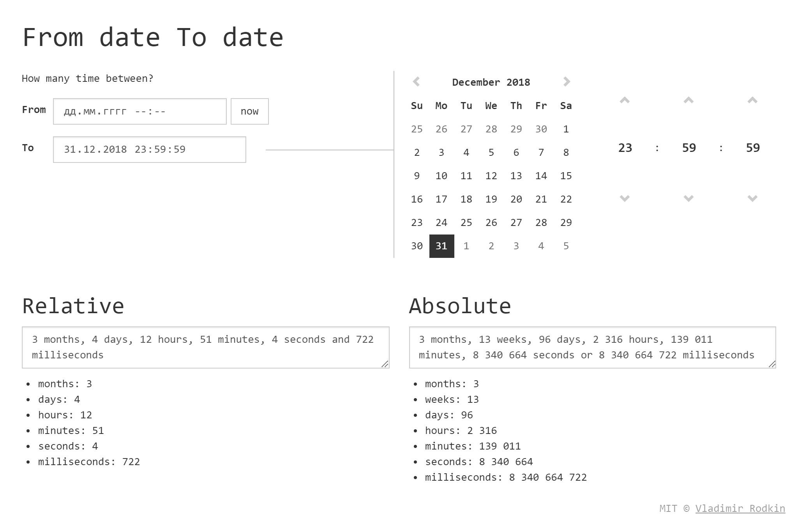

# from-date-to-date

[![XO code style][codestyle-image]][codestyle-url]

[![Build Status][travis-image]][travis-url]
[![Dependency Status][depstat-image]][depstat-url]
[![DevDependency Status][depstat-dev-image]][depstat-dev-url]

> Calculate time from date to date

Demo: [vovanr.github.io/from-date-to-date][demo]

## License
MIT © [Vladimir Rodkin](https://github.com/VovanR)

[demo]: https://vovanr.github.io/from-date-to-date

[codestyle-url]: https://github.com/xojs/xo
[codestyle-image]: https://img.shields.io/badge/code_style-XO-5ed9c7.svg?style=flat-square

[travis-url]: https://travis-ci.org/VovanR/from-date-to-date
[travis-image]: https://img.shields.io/travis/VovanR/from-date-to-date.svg?style=flat-square

[depstat-url]: https://david-dm.org/VovanR/from-date-to-date
[depstat-image]: https://david-dm.org/VovanR/from-date-to-date.svg?style=flat-square

[depstat-dev-url]: https://david-dm.org/VovanR/from-date-to-date
[depstat-dev-image]: https://david-dm.org/VovanR/from-date-to-date/dev-status.svg?style=flat-square
